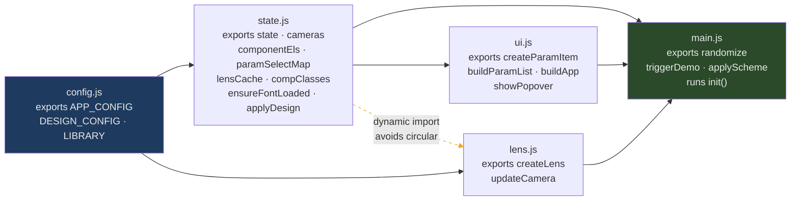
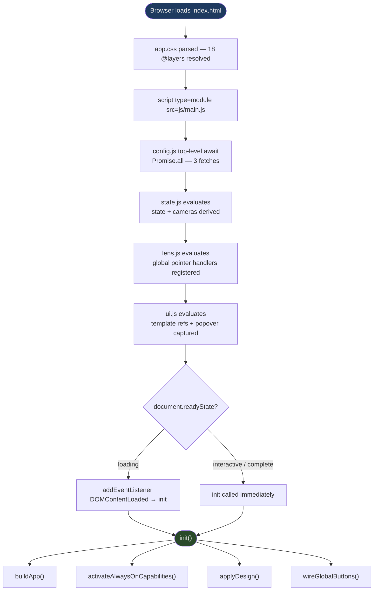

# ARCHITECTURE

High-level file structure, module graph, and data flow for Scheme Remix Studio.

## 7.1 Design Goals

- **Zero-build, no bundler, no framework** — vanilla ES modules, serve with any static server
- **Data-driven** — no JS changes to add options or lenses
- **18-layer CSS cascade** for predictable specificity
- **Module DAG with no runtime circular imports** — dynamic import in `state.js` breaks the cycle

Source: absence of `package.json`; `docs/extend/1-adding-a-new-option.md` overview; `app.css` `@layer` declaration; `state.js` `applyDesign()` dynamic import.

## 7.2 Repository Layout

```
/
├── index.html               # Shell, <template> declarations, module entry point
├── app.css                  # 18-layer CSS file
├── js/
│   ├── config.js            # Parallel config fetch, top-level await
│   ├── state.js             # State derivation, caches, applyDesign()
│   ├── lens.js              # Lens construction, camera math, pointer tracker
│   ├── ui.js                # Param UI construction, popover
│   └── main.js              # Orchestration: init, randomize, triggerDemo, applyScheme
├── data/
│   ├── app.config.json      # Runtime behaviour, camera, capability registry
│   ├── design.config.json   # PropSets, paramTypes, lenses
│   └── library.json         # Presets and schemes (empty at v0.2)
└── docs/
    ├── CONVENTIONS.md       # Canonical naming and structural rules
    ├── SCHEMAS.md           # JSON Schema Draft-07 definitions
    ├── TOKEN-MAP.md         # Complete token lineage mapping
    ├── PROP-SETS.md         # Authoritative per-prop registry
    ├── LAYER-STACK.md       # @layer ordering and responsibilities
    ├── COMPONENT-CONTRACT.md # Which propSets .the-component consumes
    ├── ARCHITECTURE.md      # This file
    ├── DIAGRAMS.md          # Standalone Mermaid diagram library
    ├── EXTENDING.md         # Index and decision guide for extend/ guides
    └── extend/
        ├── 1-adding-a-new-option.md
        ├── 2-adding-a-parameter-type.md
        ├── 3-adding-a-new-lens.md
        ├── 4-capability-layers.md
        ├── 5-presets-and-schemes.md
        ├── 6-modifying-tokens.md
        └── 7-modifying-app-config.md
```

## 7.3 JS Module DAG Diagram



## 7.4 Boot Sequence Diagram



## 7.5 Module Responsibilities

| Module | Exports | Responsibility |
|---|---|---|
| `config.js` | `APP_CONFIG`, `DESIGN_CONFIG`, `LIBRARY` | Parallel config fetch via `Promise.all` with top-level `await` |
| `state.js` | `state`, `cameras`, `componentEls`, `paramSelectMap`, `lensCache`, `compClasses`, `ensureFontLoaded`, `applyDesign` | State derivation, caches, design application |
| `lens.js` | `createLens`, `updateCamera` | Lens DOM construction, camera math, pointer tracker |
| `ui.js` | `createParamItem`, `buildParamList`, `buildApp`, `showPopover` | Parameter UI construction, popover |
| `main.js` | `randomize`, `triggerDemo`, `applyScheme` | Orchestration, init |

## 7.6 Runtime Cache Contracts

Three module-level caches from `state.js`:

```ts
componentEls:    Set<HTMLElement>
paramSelectMap:  Map<paramId: string, Set<HTMLSelectElement>>
lensCache:       Map<lensId: string, LensCacheEntry>
```

Full `LensCacheEntry` shape (sourced from `lens.js` `createLens()`):

```ts
{
  wrap:           HTMLElement,
  viewport:       HTMLElement,
  content:        HTMLElement,
  comp:           HTMLElement | null,
  badgeTL:        HTMLElement,
  badgeBL:        HTMLElement,
  originCamera:   { zoom: number, x: number, y: number },
  mode1x:         boolean,
  resizeObserver: ResizeObserver | null
}
```

**Rule:** Caches MUST be populated at creation time and MUST NOT be queried with `querySelectorAll` inside event handlers or animation frames.

## 7.7 Design Application Flow

Full path from a user changing a `<select>` to `.the-component` receiving its new class string:

1. **`select` `change` event** in `ui.js` `createParamItem()`:
   ```js
   select.addEventListener('change', (e) => {
     state[paramType.id] = e.target.value;
   });
   ```

2. **`state[paramType.id] = value`** — direct state mutation

3. **`paramSelectMap` sync** across desktop + mobile selects:
   ```js
   const set = paramSelectMap.get(paramType.id);
   for (const s of set) { if (s !== select) s.value = value; }
   ```

4. **`applyDesign()` call** — triggered after state update

5. **`ensureFontLoaded()`** — `<link>` injection if `fontsource` exists and not in `loadedFonts`:
   ```js
   if (SURFACE_FONT_SOURCES[state.surface] && !loadedFonts.has(state.surface)) {
     const link = document.createElement('link');
     link.rel = 'stylesheet';
     link.href = SURFACE_FONT_SOURCES[state.surface];
     document.head.appendChild(link);
     loadedFonts.add(state.surface);
   }
   ```

6. **`compClasses()` output**:
   ```js
   "the-component surf-velvet shape-pill depth-raised mo-elastic density-normal"
   ```

7. **`el.className = cls`** for all `componentEls`:
   ```js
   for (const el of componentEls) el.className = cls;
   ```

8. **Dynamic import `lens.js`** → `rAF` → `updateCamera()` for non-fixed lenses:
   ```js
   import('./lens.js').then(({ updateCamera }) => {
     requestAnimationFrame(() => {
       for (const lensId of Object.keys(cameras)) {
         const cache = lensCache.get(lensId);
         if (cache && !cache.wrap.classList.contains('lens-fixed')) {
           updateCamera(lensId);
         }
       }
     });
   });
   ```
