# DIAGRAMS

Standalone Mermaid diagram library. Each diagram is numbered, titled, and 100% accurate to source behaviour.

## 1 — Boot & Init Sequence

This diagram shows the full boot sequence from browser load to `init()` execution. It runs once when the page first loads.

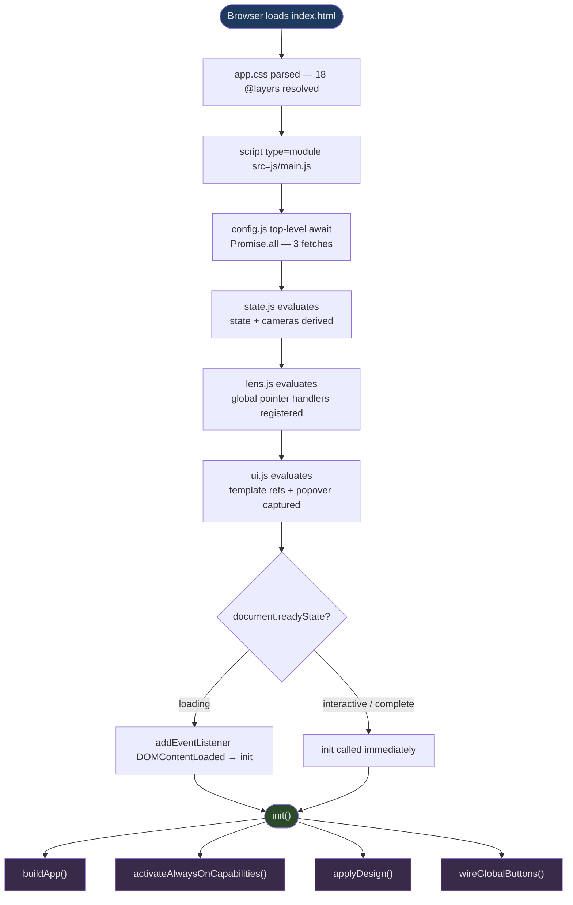

## 2 — Config Fetch (`config.js`)

This diagram shows how `config.js` fetches all three JSON config files in parallel and exports them. It runs once at module evaluation time.

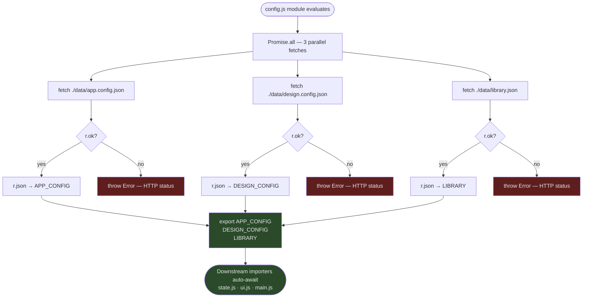

## 3 — State Derivation (`state.js`)

This diagram shows how `state.js` derives its module-level state and caches from `DESIGN_CONFIG`. It runs once at module evaluation time.

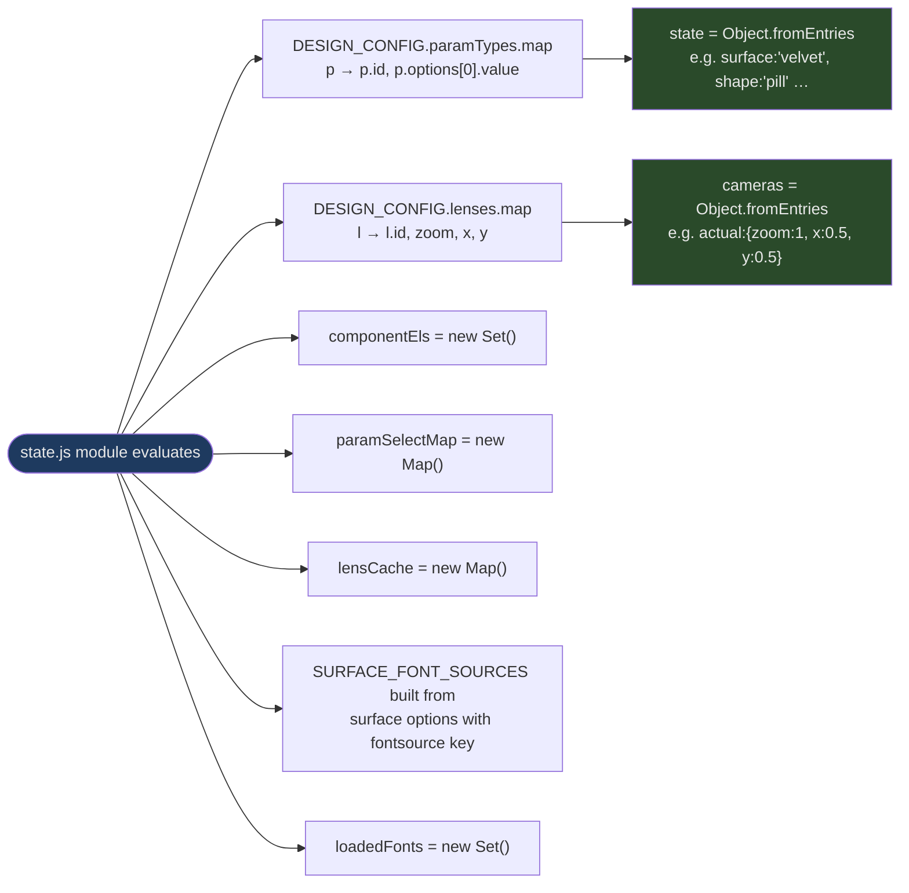

## 4 — `buildApp()` DOM Construction (`ui.js`)

This diagram shows how `buildApp()` constructs the entire app DOM from templates and config. It runs once during `init()`.

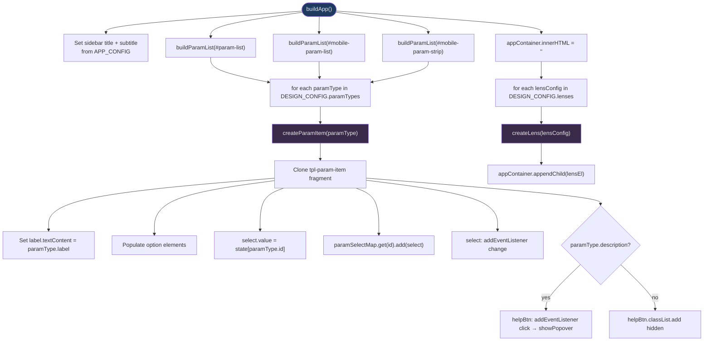

## 5 — `createLens()` Factory (`lens.js`)

This diagram shows how `createLens()` builds a single lens panel from a lens config object. It runs once per lens during `buildApp()`.

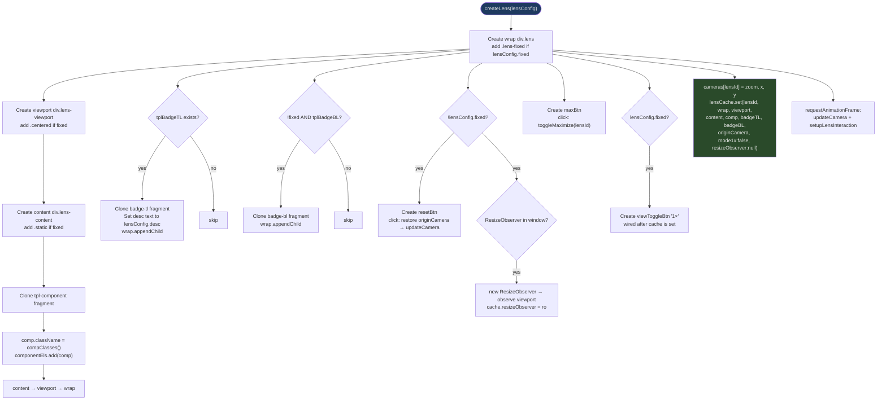

## 6 — `applyDesign()` (`state.js`)

This diagram shows the full `applyDesign()` flow from font loading to class stamping. It runs on every parameter change and during `init()`.

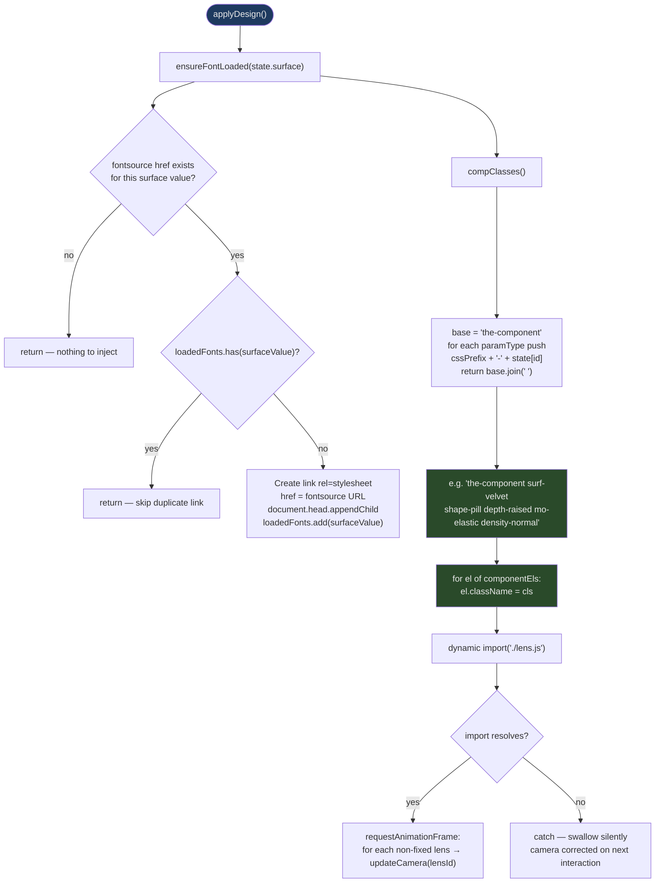

## 7 — `updateCamera()` Math (`lens.js`)

This diagram shows the camera transform math that positions the component inside a lens viewport. It runs on every pan, zoom, or resize event.

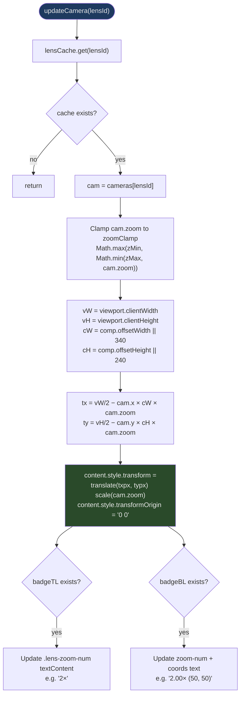

**Transform formula:**
```
tx = vW/2 − cam.x × cW × cam.zoom
ty = vH/2 − cam.y × cH × cam.zoom
content.style.transform = translate(tx px, ty px) scale(cam.zoom)
```

Source: `lens.js` `updateCamera()`.

## 8 — Lens Pointer / Wheel / Touch Interactions

This diagram shows the per-lens and global pointer handlers that enable pan, zoom, and touch interactions. The per-lens handlers run on each lens viewport; the global handlers run once on `window`.

```mermaid
flowchart TD
    subgraph PerLens ["Per-lens viewport listeners — setupLensInteraction"]
        PD["pointerdown"] --> AD["activeDrag = lensId, lastX, lastY<br/>viewport.classList.add 'dragging'"]
        WH["wheel"] --> WZ["factor = deltaY < 0 ? 1.12 : 0.9<br/>cam.zoom = clamp(cam.zoom × factor)<br/>updateCamera(lensId)"]
        TS["touchstart"] --> LT["lastTouches = Array.from(e.touches)"]
        TM["touchmove"] --> TC{"touch count?"}
        TC -->|"1 finger"| PAN["cam.x -= dx / cW×zoom — clamped<br/>cam.y -= dy / cH×zoom — clamped<br/>updateCamera(lensId)"]
        TC -->|"2 fingers"| PINCH["cam.zoom *= newDist / prevDist — clamped<br/>updateCamera(lensId)"]
        TE["touchend"] --> UT["lastTouches = Array.from(e.touches)"]
    end

    subgraph Global ["Global window listeners — registered once at module eval"]
        PM["window pointermove"] --> AI{"activeDrag?"}
        AI -->|"null"| SK["return"]
        AI -->|"set"| CALC["dx = e.clientX - lastX<br/>dy = e.clientY - lastY<br/>cam.x/y adjusted + clamped<br/>activeDrag.lastX/Y = e.clientX/Y<br/>updateCamera(lensId)"]
        PU["window pointerup"] --> AU{"activeDrag?"}
        AU -->|"null"| SK2["return"]
        AU -->|"set"| CLR["viewport.classList.remove 'dragging'<br/>activeDrag = null"]
    end

    style PerLens fill:#1a2e1a
    style Global fill:#1a1a2e
```

## 9 — Param `<select>` Change Flow

This diagram shows the full flow from a user changing a parameter select to the component updating. It runs on every parameter change.

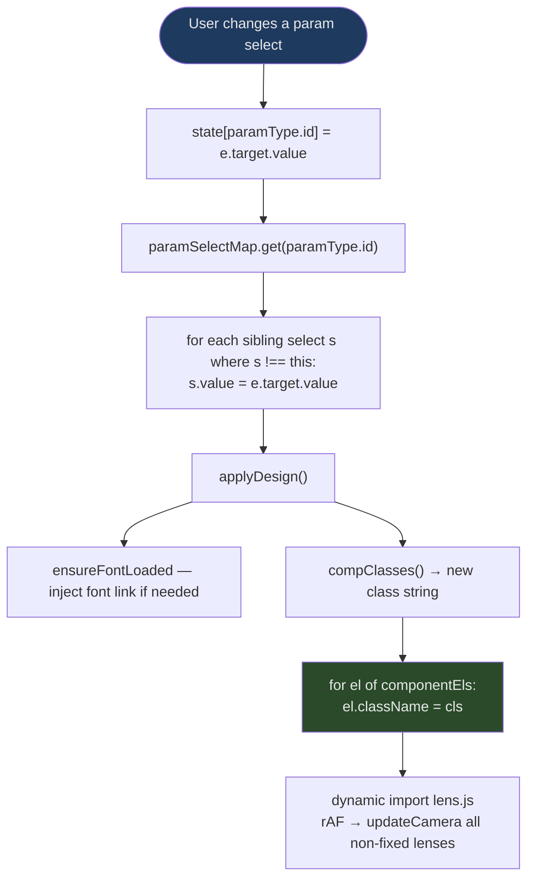

## 10 — `randomize()` (`main.js`)

This diagram shows how `randomize()` picks a random option for each parameter and applies it. It runs when the user clicks the Randomize button.

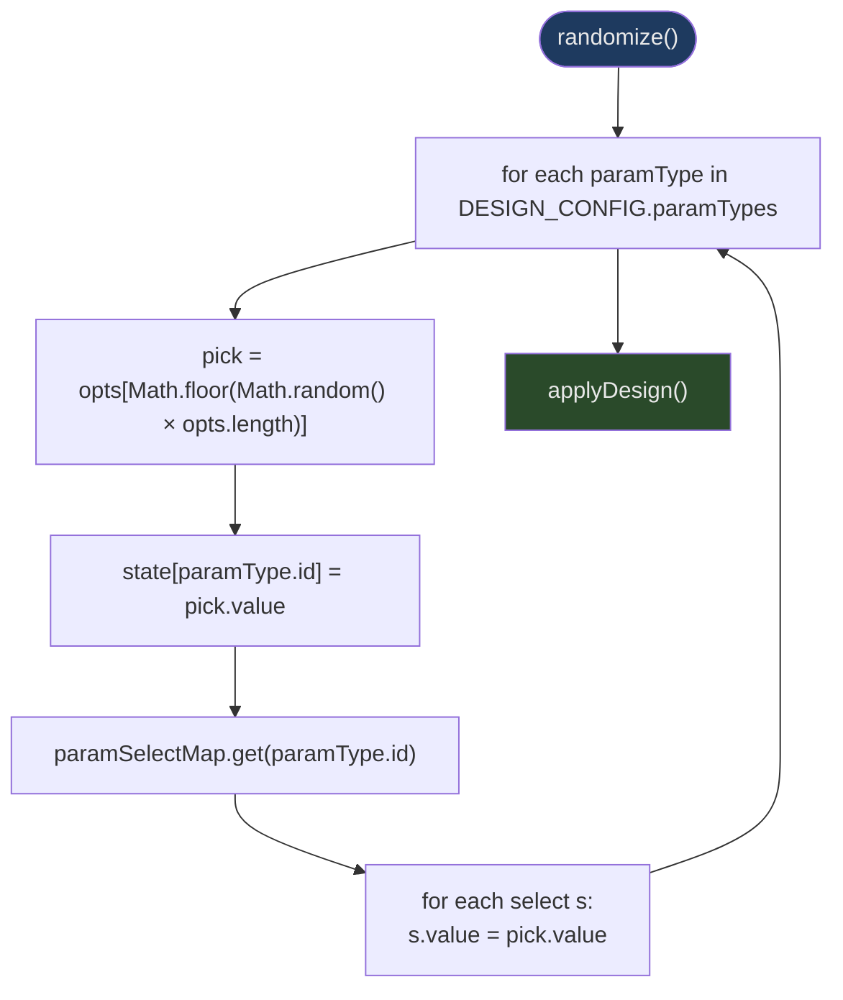

## 11 — `triggerDemo()` (`main.js`)

This diagram shows how `triggerDemo()` staggers the `.demo-active` class across all component instances. It runs when the user clicks the Run Demo button.

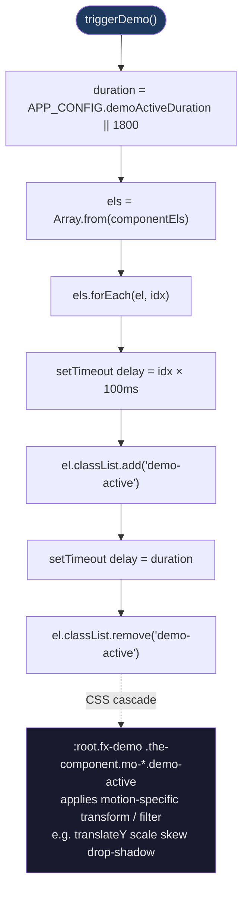

**Stagger formula:**
```
delay per component = idx × 100ms
total animation end = demoActiveDuration + (componentCount − 1) × 100ms
```

Source: `main.js` `triggerDemo()`.

## 12 — `applyScheme()` (`main.js`)

This diagram shows how `applyScheme()` merges presets and activates capability layers. It runs when a scheme is invoked via `applyScheme('scheme-id')`.

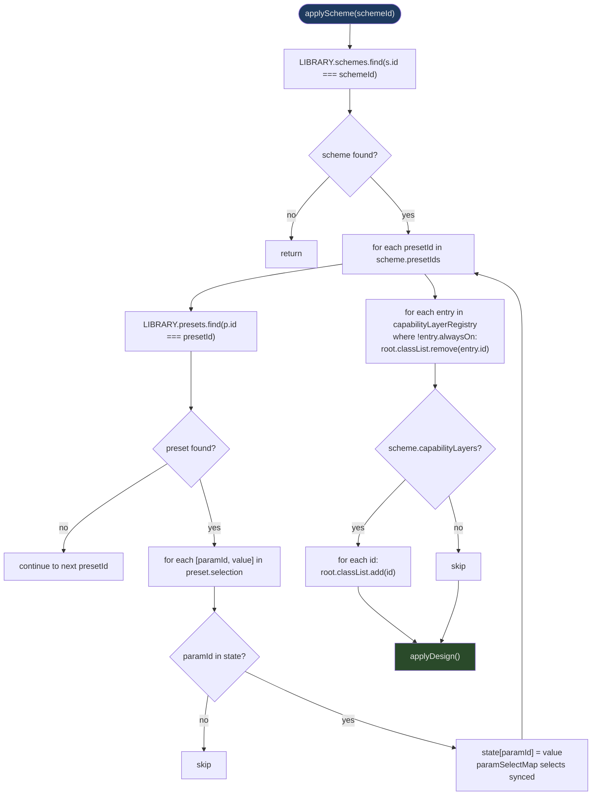

## 13 — Maximize / Restore (`lens.js`)

This diagram shows how `toggleMaximize()` expands a lens to full viewport or restores it. It runs when the user clicks the maximize button.

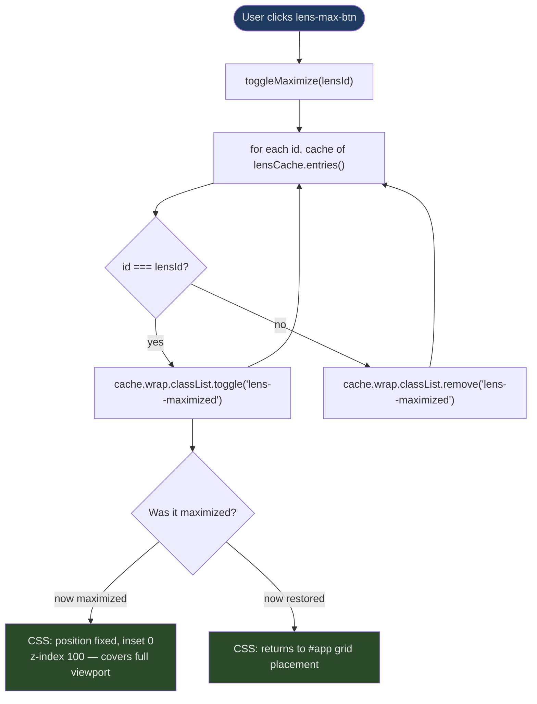

## 14 — Fit / 1× Toggle (fixed lens, `lens.js`)

This diagram shows how the fixed lens toggles between fit-to-viewport and 1:1 pixel rendering. It runs when the user clicks the 1×/Fit button.

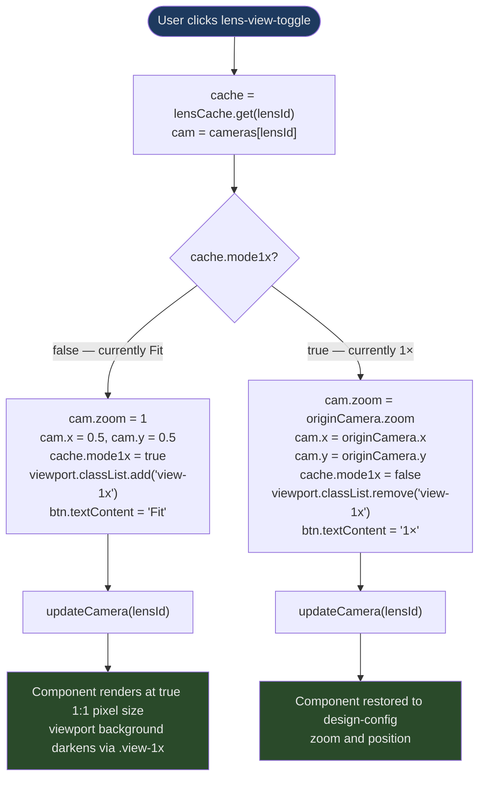

## 15 — Popover Show / Hide (`ui.js`)

This diagram shows how `showPopover()` positions the global popover and how it's dismissed. It runs when the user clicks a help button.

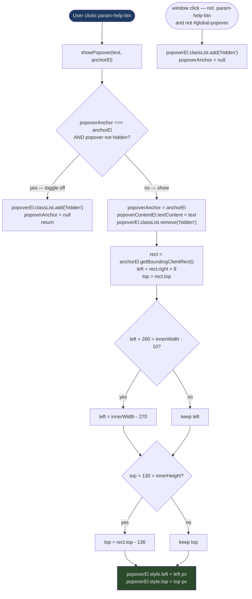

## 16 — Mobile Overlay Flow (`main.js`)

This diagram shows how the mobile overlay is shown and hidden. It runs when the user interacts with mobile UI buttons.

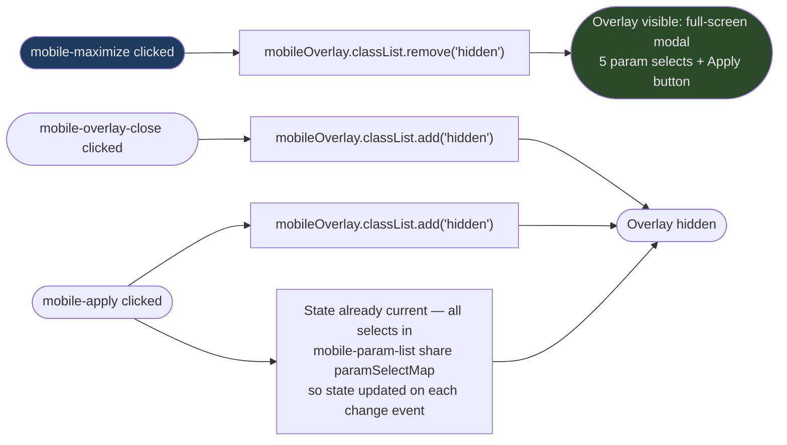

## 17 — CSS Token Resolution Cascade (`app.css`)

This diagram shows how CSS custom properties cascade from Tier 1 primitives through semantic aliases to component defaults and finally to the component. It runs on every paint.

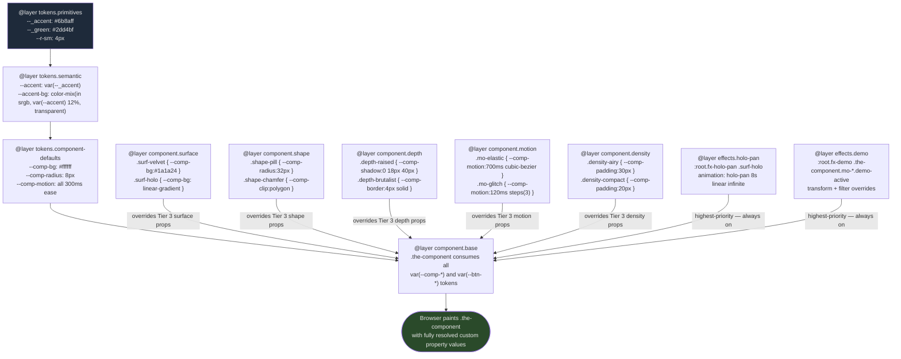

## 18 — JS Module DAG

This diagram shows the import relationships between all JS modules. The dashed arrow indicates a dynamic import used to break a circular dependency.

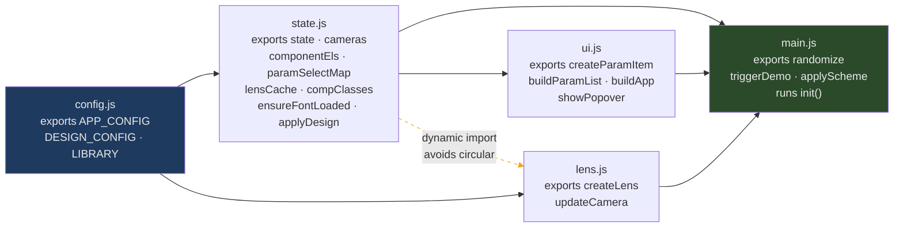
