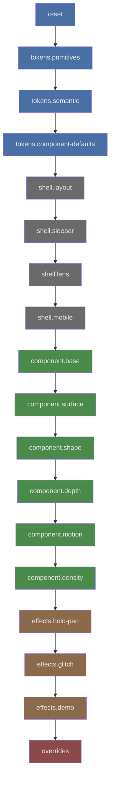

# LAYER-STACK

Canonical CSS `@layer` ordering and per-layer responsibilities.

## Opening Diagram

**Color coding:**
- Blue: Token layers (1–4)
- Gray: Shell layers (5–8)
- Green: Component layers (9–14)
- Orange: Effects layers (15–17)
- Red: Overrides (18)

## Per-Layer Table

| Position | Layer name | Responsibility | Key selectors/rules |
|---|---|---|---|
| 1 | `reset` | Global resets and element normalization | `* { margin:0; padding:0; box-sizing:border-box }` |
| 2 | `tokens.primitives` | Raw palette, radius/spacing/z scales, layout primitives | `:root { --_bg-950: #0a0a0a; --sidebar-width: 280px }` |
| 3 | `tokens.semantic` | Intent aliases referencing Tier 1 values | `:root { --bg: var(--_bg-950); --accent: var(--_accent) }` |
| 4 | `tokens.component-defaults` | All `--comp-*` and `--btn-*` fallback values | `:root { --comp-bg: #ffffff; --comp-radius: 8px }` |
| 5 | `shell.layout` | Page shell and app grid layout | `#app { grid-template-rows: 2fr / 1.2fr }` |
| 6 | `shell.sidebar` | Sidebar, parameter list, actions, popover | `.sidebar`, `.param-list`, `.actions` |
| 7 | `shell.lens` | Lens containers, viewports, badges, nth-of-type placement | `.lens`, `.lens-viewport`, `.lens-badge` |
| 8 | `shell.mobile` | Mobile layout and overlay rules | `.mobile-overlay`, `.mobile-bar` |
| 9 | `component.base` | `.the-component`, `.comp-actions`, `.comp-btn` consume all tokens | `.the-component { background: var(--comp-bg) }` |
| 10 | `component.surface` | All `.surf-*` classes | `.surf-velvet { --comp-bg: #1a1a24 }` |
| 11 | `component.shape` | All `.shape-*` classes | `.shape-pill { --comp-radius: 32px }` |
| 12 | `component.depth` | All `.depth-*` classes | `.depth-raised { --comp-shadow: 0 18px 40px }` |
| 13 | `component.motion` | All `.mo-*` classes | `.mo-elastic { --comp-motion: 700ms cubic-bezier }` |
| 14 | `component.density` | All `.density-*` classes | `.density-airy { --comp-padding: 30px }` |
| 15 | `effects.holo-pan` | Holo animation and scoping | `:root.fx-holo-pan .surf-holo { animation: holo-pan 8s linear infinite }` |
| 16 | `effects.glitch` | Optional glitch effect layer | `:root.fx-glitch .the-component { animation: glitch 0.3s steps(3) }` |
| 17 | `effects.demo` | Demo-active and fixed-lens hover transforms | `:root.fx-demo .the-component.mo-*.demo-active { transform: translateY(-4px) }` |
| 18 | `overrides` | Highest-priority escape hatch | `.lens:not(.lens-fixed) .the-component { min-width: 280px }` |

## Extension Rule

New `component.*` layers MUST be inserted between `component.density` and `effects.holo-pan`, and MUST be registered in the `@layer` declaration at the top of `app.css`.

Source: `docs/extend/2-adding-a-parameter-type.md` step 6.
