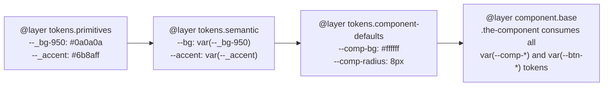

# TOKEN-MAP

Complete mapping from Tier 1 primitives to semantic aliases to component defaults. This is the single source of truth for CSS token lineage.

## 3.1 Three-Tier Flow Diagram

## 3.2 Tier 1 Primitives Table

Source: `app.css` `@layer tokens.primitives` `:root` block.

### Color palette

| Custom Property | Value | Scale |
|---|---|---|
| `--_bg-950` | `#0a0a0a` | Darkest background |
| `--_bg-900` | `#1a1a1a` | Panel background |
| `--_bg-800` | `#2a2a2a` | Input/badge background |
| `--_border-low` | `#3a3a3a` | Low-emphasis border |
| `--_border-mid` | `#4a4a4a` | Higher-emphasis border |
| `--_text-hi` | `#e8e8e8` | Primary text |
| `--_text-mid` | `#b0b0b0` | Secondary text |
| `--_text-lo` | `#808080` | Tertiary text |
| `--_accent` | `#6b8aff` | Accent UI states |
| `--_green` | `#2dd4bf` | Lens badge status |

### Radius scale

| Custom Property | Value | Scale |
|---|---|---|
| `--r-xs` | `2px` | Extra small |
| `--r-sm` | `4px` | Small |
| `--r-md` | `8px` | Medium |
| `--r-lg` | `12px` | Large |
| `--r-xl` | `16px` | Extra large |
| `--r-2xl` | `24px` | 2× extra large |

### Spacing scale

| Custom Property | Value | Scale |
|---|---|---|
| `--sp-xs` | `4px` | Extra small |
| `--sp-sm` | `8px` | Small |
| `--sp-md` | `12px` | Medium |
| `--sp-lg` | `16px` | Large |
| `--sp-xl` | `24px` | Extra large |

### Z-index scale

| Custom Property | Value | Scale |
|---|---|---|
| `--z-lens-overlay` | `10` | Lens overlays |
| `--z-maximized` | `100` | Maximized lens state |
| `--z-mobile-bar` | `50` | Mobile bar |
| `--z-popover` | `1000` | Global popover |

### Layout

| Custom Property | Value | Scale |
|---|---|---|
| `--sidebar-width` | `280px` | App grid column width |

**Total: 26 entries** — verified against `data/app.config.json` `primitiveRegistry` (26 items).

## 3.3 Tier 2 Semantic Aliases Table

Source: `app.css` `@layer tokens.semantic`.

| Semantic Token | Resolves To | Intent |
|---|---|---|
| `--bg` | `var(--_bg-950)` | App shell background |
| `--panel` | `var(--_bg-900)` | Sidebar and panels |
| `--panel-2` | `var(--_bg-800)` | Inputs, popovers, badges |
| `--border` | `var(--_border-low)` | Low-emphasis borders |
| `--border-2` | `var(--_border-mid)` | Higher-emphasis borders |
| `--text` | `var(--_text-hi)` | Primary text |
| `--text-dim` | `var(--_text-mid)` | Secondary text |
| `--text-muted` | `var(--_text-lo)` | Tertiary text |
| `--accent` | `var(--_accent)` | Accent UI states |
| `--green` | `var(--_green)` | Lens badge status |

### Derived alpha tokens (color-mix)

| Semantic Token | Resolves To | Intent |
|---|---|---|
| `--accent-bg` | `color-mix(in srgb, var(--accent) 12%, transparent)` | Hover and action backgrounds |
| `--green-bg` | `color-mix(in srgb, var(--green) 10%, transparent)` | Lens badge background |
| `--green-bdr` | `color-mix(in srgb, var(--green) 28%, transparent)` | Lens badge border |

### Typography tokens

| Semantic Token | Intent |
|---|---|
| `--mono` | Labels, badges, technical UI |
| `--sans` | Base sans-serif stack |

## 3.4 Tier 3 Component Defaults

Source: `data/design.config.json` `propSets[*].props[*].initial`.

### surfaceMaterial

| Custom Property | Initial Value | registerProperty |
|---|---|---|
| `--comp-bg` | `ffffff` | false |
| `--comp-bg-img` | `none` | false |
| `--comp-bg-size` | `auto` | false |
| `--comp-bg-pos` | `0 0` | false |
| `--comp-backdrop` | `none` | false |
| `--comp-color` | `000000` | true |
| `--comp-font` | `var(--sans)` | false |
| `--comp-font-weight` | `400` | false |
| `--comp-text-transform` | `none` | false |
| `--comp-letter-spacing` | `normal` | false |
| `--btn-bg` | `eeeeee` | false |
| `--btn-color` | `inherit` | false |

### shapeGeometry

| Custom Property | Initial Value | registerProperty |
|---|---|---|
| `--comp-radius` | `8px` | true |
| `--comp-clip` | `none` | false |
| `--btn-radius` | `4px` | true |
| `--btn-clip` | `none` | false |

### depthElevation

| Custom Property | Initial Value | registerProperty |
|---|---|---|
| `--comp-shadow` | `none` | false |
| `--comp-border` | `1px solid transparent` | false |
| `--btn-shadow` | `none` | false |
| `--btn-border` | `1px solid transparent` | false |

### motionDynamics

| Custom Property | Initial Value | registerProperty |
|---|---|---|
| `--comp-motion` | `all 300ms ease` | false |

### spatialDensity

| Custom Property | Initial Value | registerProperty |
|---|---|---|
| `--comp-padding` | `28px` | true |
| `--comp-gap` | `0px` | true |
| `--comp-font-size-base` | `1rem` | true |
| `--comp-line-height` | `1.6` | true |
| `--btn-padding` | `11px 20px` | false |

## 3.5 Read-Only Rule

**MUST** statement: Tier 1 primitives are read-only at runtime.

**MUST** statement: Tier 3 fallbacks MUST only be defined in `tokens.component-defaults`.

Source: `app.css` `@layer tokens.primitives` (read-only); `docs/extend/6-modifying-tokens.md` (fallback placement rule).
