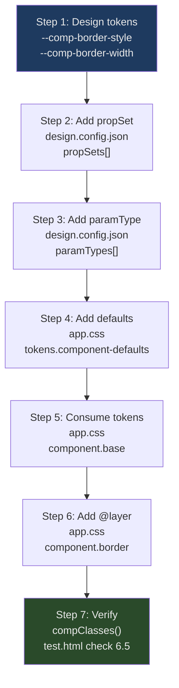

# HOWTO: Add a New Parameter Type (Design Axis)

This guide walks through adding a completely new design axis — a new dropdown in the sidebar with its own set of CSS tokens that control a new visual dimension.

## Overview

A "parameter type" (`paramType`) is one independently-controllable design axis, such as `Surface Material`, `Shape Geometry`, or `Spatial Density`. Each `paramType` maps to one CSS class applied to `.the-component` and a set of CSS custom properties (a `propSet`) those classes override.

Adding a new `paramType` touches three files:
- `data/design.config.json` — declare the `propSet` and `paramType`
- `app.css` — add `tokens.component-defaults` entries + a new `@layer` block
- `docs/COMPONENT-CONTRACT.md` — update the contract (documentation)

No changes to any JavaScript file are required.

## Step 1 — Design your new tokens

Decide what CSS custom properties your new axis will control. Token names MUST follow the `--comp-*` or `--btn-*` naming convention.

Example axis: "Border Style" — controls decorative border patterns.

New tokens:
- `--comp-border-style` — CSS border-style value (e.g., solid, dashed, double)
- `--comp-border-width` — CSS border-width value (e.g., 1px, 3px)

## Step 2 — Add a `propSet` to `design.config.json`

Open `data/design.config.json`. Add a new object to the top-level `propSets` array.

```json
{
  "id": "borderStyle",
  "label": "Border Style",
  "props": [
    {
      "name": "--comp-border-style",
      "cssType": "string",
      "initial": "solid",
      "registerProperty": false
    },
    {
      "name": "--comp-border-width",
      "cssType": "length",
      "initial": "1px",
      "registerProperty": true
    }
  ]
}
```

- `id` — lowerCamelCase unique identifier for the `propSet`.
- `initial` — the default value, declared in `tokens.component-defaults` (Step 4).
- `registerProperty: true` — use for interpolatable types (length, number, color) to enable CSS `@property` registration and smooth transitions.

## Step 3 — Add the `paramType` to `design.config.json`

In the same file, add a new object to the `paramTypes` array:

```json
{
  "id": "borderStyle",
  "cssPrefix": "bdr",
  "label": "Border Style",
  "description": "Controls the decorative border treatment of the component",
  "propSetIds": ["borderStyle"],
  "options": [
    { "value": "none",   "label": "None — Invisible Border" },
    { "value": "solid",  "label": "Solid — Clean Line" },
    { "value": "dashed", "label": "Dashed — Broken Line" },
    { "value": "double", "label": "Double — Classic Frame" },
    { "value": "groove", "label": "Groove — Engraved Effect" }
  ]
}
```

- `id` — must be unique across all `paramTypes`; used as the state key.
- `cssPrefix` — the prefix for all CSS option classes (`bdr-none`, `bdr-solid`, etc.).
- `propSetIds` — references one or more `propSet` id values from Step 2.
- `options[].value` — combined with `cssPrefix` to form the class name.

## Step 4 — Add defaults to `tokens.component-defaults` in `app.css`

Open `app.css`. Find `@layer tokens.component-defaults`. Add your new tokens' default values inside the `:root` block:

```css
@layer tokens.component-defaults {
  :root {
    /* ... existing tokens ... */

    /* Border Style defaults */
    --comp-border-style: solid;
    --comp-border-width: 1px;
  }
}
```

> Rule: Fallback values for component tokens MUST be defined only here,
> never inline inside component or option rules.

## Step 5 — Consume tokens in `@layer component.base`

Open `app.css` and find `@layer component.base`. Add your new tokens to `.the-component` and/or `.comp-btn` so they are actually applied:

```css
@layer component.base {
  .the-component {
    /* ... existing properties ... */
    border-style: var(--comp-border-style);
    border-width: var(--comp-border-width);
  }
}
```

Update `docs/COMPONENT-CONTRACT.md` to document this new consumption.

## Step 6 — Add the `@layer component.[name]` block

Declare a new `@layer` block in `app.css`. It MUST be placed AFTER `component.density` and BEFORE `effects.holo-pan` in the layer stack.

Register it in the `@layer` declaration at the top of the file first:

```css
/* At the top of app.css, update the @layer declaration: */
@layer
  reset,
  tokens.primitives,
  tokens.semantic,
  tokens.component-defaults,
  shell.layout,
  shell.sidebar,
  shell.lens,
  shell.mobile,
  component.base,
  component.surface,
  component.shape,
  component.depth,
  component.motion,
  component.density,
  component.border,        /* ← new layer */
  effects.holo-pan,
  effects.glitch,
  effects.demo,
  overrides;
```

Then add the layer block:

```css
/* ===========================
   Component — Border Style
   =========================== */
@layer component.border {
  .bdr-none {
    --comp-border-style: none;
    --comp-border-width: 0px;
  }

  .bdr-solid {
    --comp-border-style: solid;
    --comp-border-width: 1px;
  }

  .bdr-dashed {
    --comp-border-style: dashed;
    --comp-border-width: 2px;
  }

  .bdr-double {
    --comp-border-style: double;
    --comp-border-width: 4px;
  }

  .bdr-groove {
    --comp-border-style: groove;
    --comp-border-width: 3px;
  }
}
```

## Step 7 — Verify `compClasses()`

`compClasses()` in `state.js` auto-generates one class per `paramType` by iterating `DESIGN_CONFIG.paramTypes`. No JS changes are needed. After adding the new `paramType`, `.the-component` will have one additional class: `bdr-[selectedValue]`.

Run `test.html` and verify check 6.5 ("Class builder") passes — the expected count will now be 7 (one per `paramType` + `the-component`). Update the test if needed.

## Flow Diagram



## Checklist

- [ ] `propSet` added to `design.config.json` with correct id, label, and props
- [ ] `paramType` added to `design.config.json` with id, `cssPrefix`, `propSetIds`, and options
- [ ] Default token values added to `tokens.component-defaults` in `app.css`
- [ ] Tokens consumed in `@layer component.base` on `.the-component` and/or `.comp-btn`
- [ ] New `@layer component.[name]` block added and registered in the `@layer` declaration
- [ ] One CSS class per option value following `[cssPrefix]-[value]`
- [ ] `docs/COMPONENT-CONTRACT.md` updated
- [ ] `test.html` check 6.5 class count updated
